<h1 align="center">🚚 ShipmentSure – Predicting On-Time Delivery Using Supplier Data</h1>
<p align="center">
  <b>A Machine Learning Project by Arpita Mishra</b>
</p>

---

## 🚀 Project Overview

**ShipmentSure** is a machine-learning powered application designed to predict whether a shipment will arrive **on time** or **late**, based on supplier behavior, product characteristics, and logistical features.

The project covers the complete end-to-end ML workflow:

✔ Data Cleaning & Preprocessing  
✔ Exploratory Data Analysis (EDA)  
✔ Handling Class Imbalance  
✔ Feature Engineering  
✔ Model Training & Evaluation  
✔ Saving Model Artifacts  
✔ Web App Deployment using Streamlit  

---

## 📊 Dataset Information

- **Total Records:** 10,999  
- **Features:** 12 (8 numerical + 4 categorical)  
- **Target Variable:** `Reached.on.Time_Y.N`  
  - **0 → On Time**  
  - **1 → Late**

### 📌 Class Distribution
- **Late:** ~60%  
- **On-Time:** ~40%  

---

## 🔍 Exploratory Data Analysis (EDA)

### ✔ Univariate Analysis
- Warehouse Block: Spread across A–F  
- Mode of Shipment: Mostly **Ship**, followed by Flight and Road  
- Product Importance: Mostly **Low**  
- Customer Rating: Uniform from 1–5  
- Discounts: Skewed towards lower values  
- Weight: Long-tail distribution  

### ✔ Bivariate Insights
- Higher **discounts** → More late deliveries  
- More **customer care calls** → More delays  
- Higher **weight** → Later delivery likelihood increases  
- **Flight** shipments have better delivery performance  

### ✔ Correlation Highlights
- Strong positive correlation: **Cost ↔ Weight**  
- Higher discounts associated with **late deliveries**  

## 📊 Exploratory Data Analysis (EDA)

Below are key visual insights from the dataset.

---

### 🔥 1. Target Variable Distribution
<p align="center">
  
</p>

---

### 🔥 2. Before & After SMOTE (Class Balancing)

#### 📌 Bar Comparison
<p align="center">
  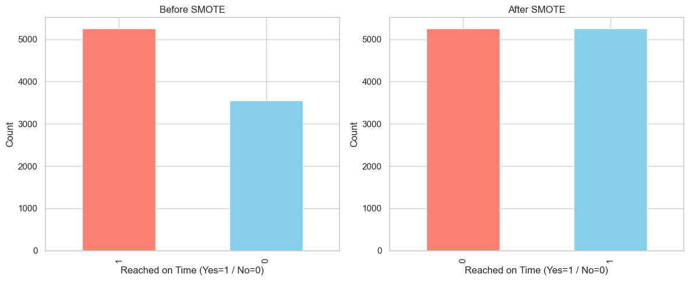
</p>

#### 📌 Pie Comparison
<p align="center">
  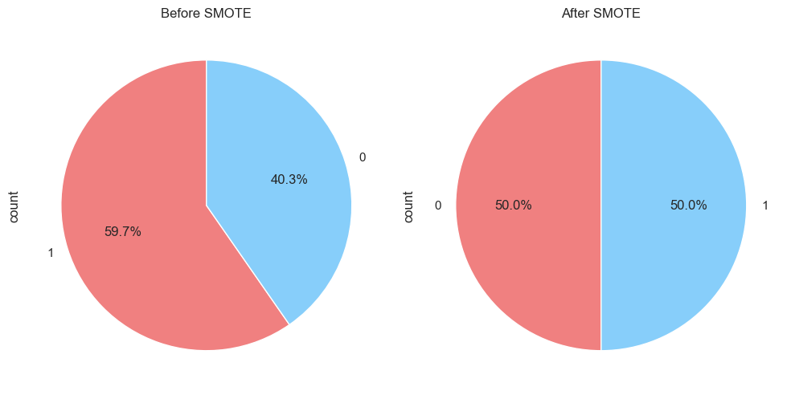
</p>

---

## 🔸 3. Categorical Feature Distributions

### 📦 Warehouse Block Distribution
<p align="center">
  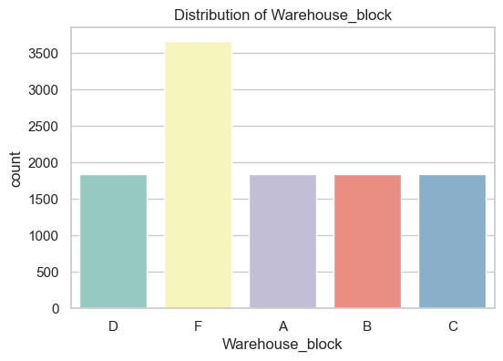
</p>

### 🚚 Mode of Shipment Distribution
<p align="center">
  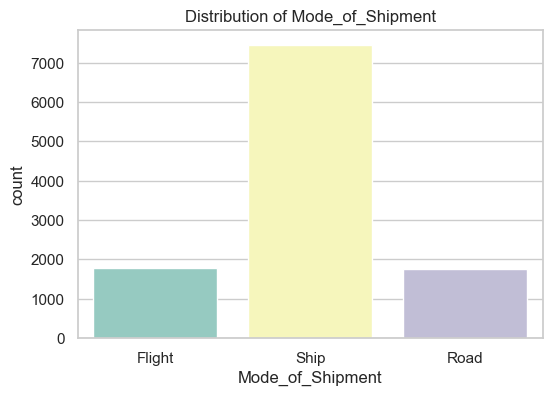
</p>

### 🎚 Product Importance Distribution
<p align="center">
  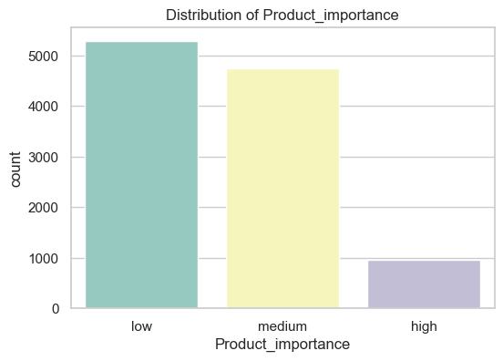
</p>

### 👤 Gender Distribution
<p align="center">
  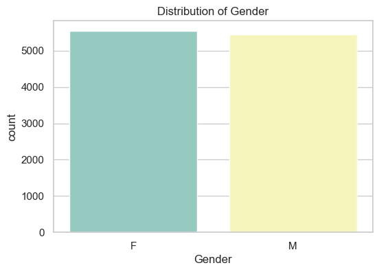
</p>

---

## 🔸 4. Numerical Feature Distributions

### ☎ Customer Care Calls
<p align="center">
  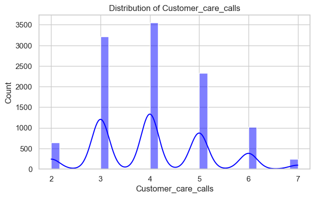
</p>

### ⭐ Customer Rating
<p align="center">
  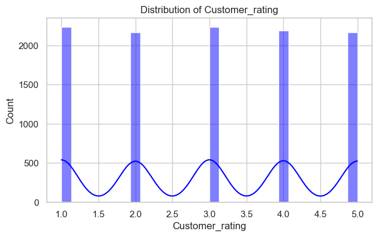
</p>

### 💰 Cost of the Product
<p align="center">
  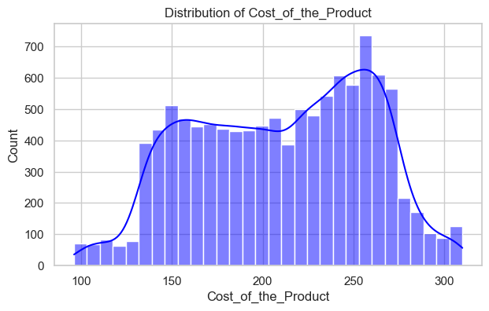
</p>

### 💸 Discount Offered
<p align="center">
  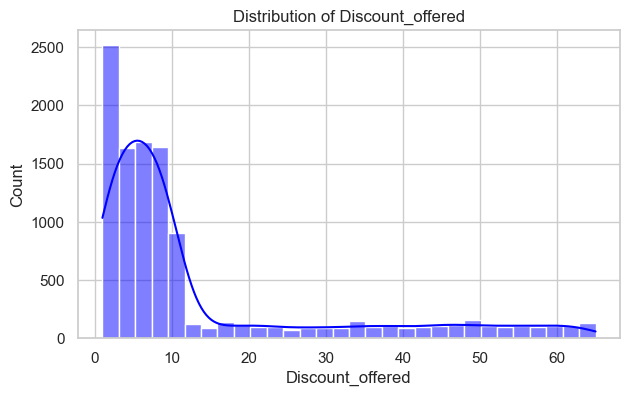
</p>

### ⚖ Weight (in gms)
<p align="center">
  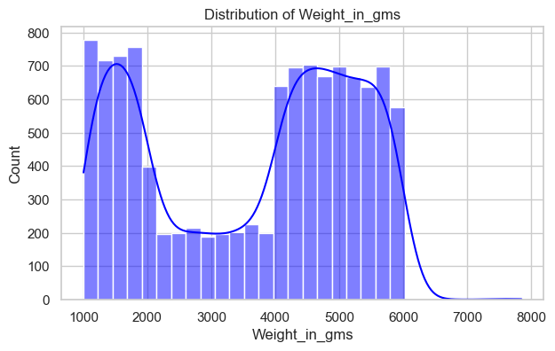
</p>

---

## 🔸 5. Categorical Features vs Delivery Status

### 📦 Warehouse Block vs Status
<p align="center">
  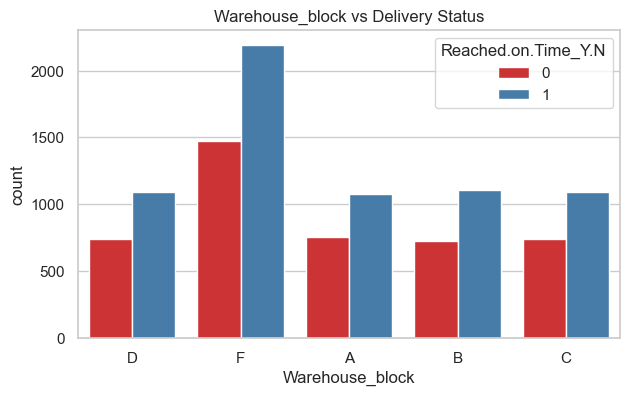
</p>

### 🚚 Mode of Shipment vs Status
<p align="center">
  
</p>

### 🎚 Product Importance vs Status
<p align="center">
  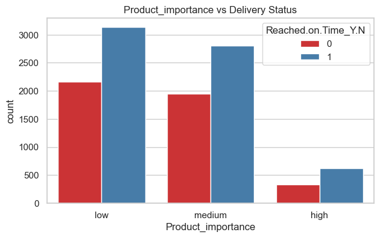
</p>

### 👤 Gender vs Status
<p align="center">
  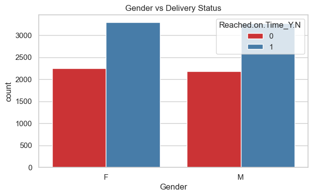
</p>

### 🛒 Prior Purchases vs Status
<p align="center">
  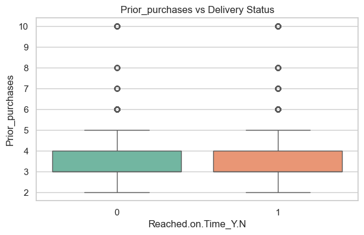
</p>

---

## 🔸 6. Numerical Features vs Delivery Status

### ☎ Customer Care Calls vs Status
<p align="center">
  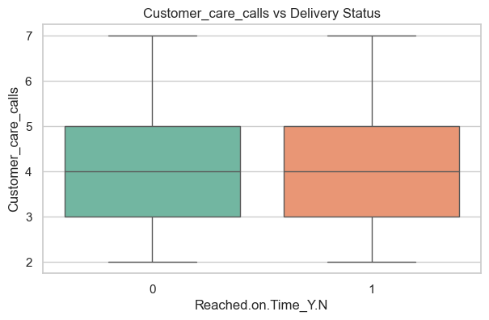
</p>

### ⭐ Customer Rating vs Status
<p align="center">
  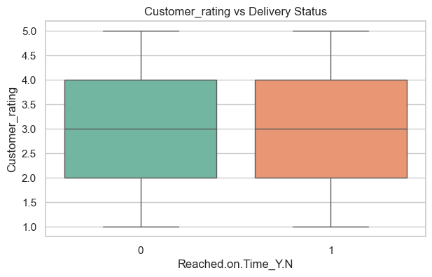
</p>

### 💸 Discount Offered vs Status
<p align="center">
  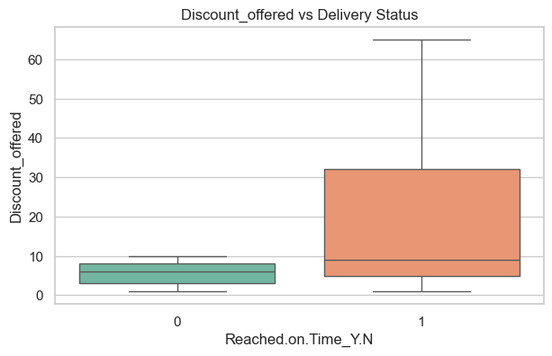
</p>

### 💰 Cost of the Product vs Status
<p align="center">
  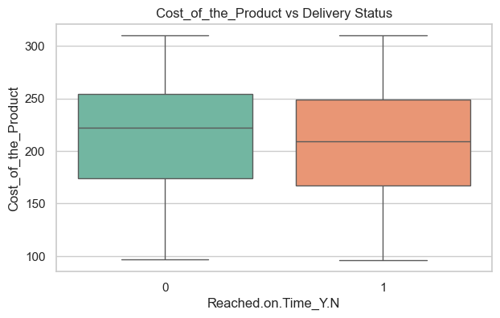
</p>

### ⚖ Weight vs Status
<p align="center">
  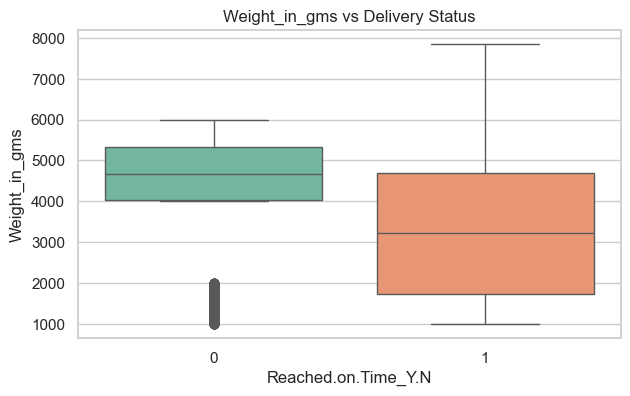
</p>

---

## 🔥 7. Correlation Heatmap
<p align="center">
  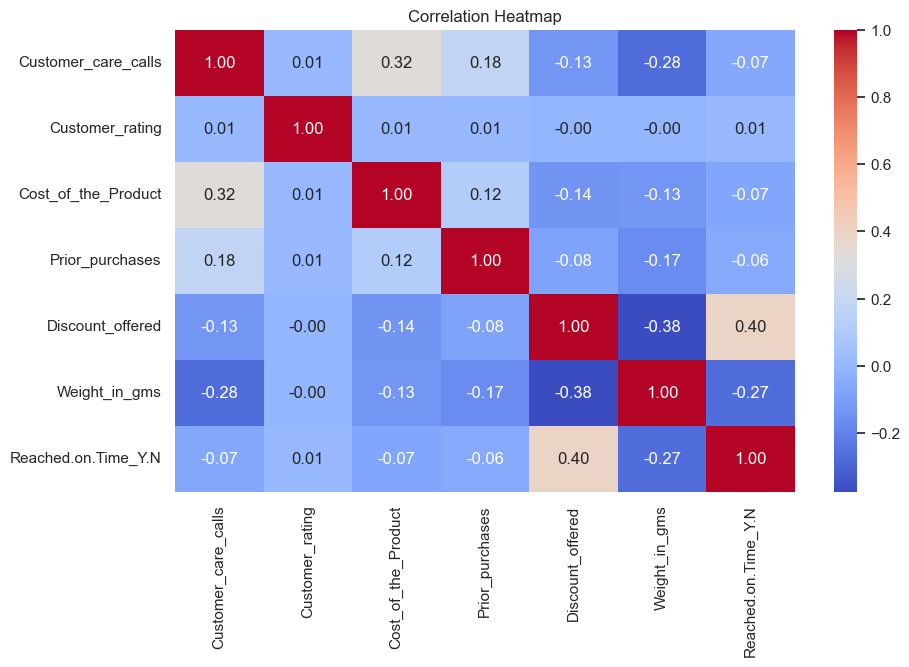
</p>

---


## ⚖ Handling Class Imbalance

The target variable was imbalanced:
- **Class 1 (Late): 6563**
- **Class 0 (On Time): 4436**

To solve this, **SMOTE (Synthetic Minority Oversampling Technique)** was applied to balance the training data.

---

## 🛠 Data Preprocessing

- Checked for Missing Values → **None found**
- **Label Encoding** → Gender, Product Importance  
- **One-Hot Encoding** → Warehouse Block, Mode of Shipment  
- **Feature Scaling** → StandardScaler  
- **Train–Test Split** → 80:20 (stratified)
- Saved all processed datasets for reuse  

---

## 🤖 Machine Learning Models Used

The following models were trained and evaluated:

- XGBoost Classifier  
- Random Forest Classifier  
- Gradient Boosting Classifier  
- Logistic Regression  

### Evaluation Metrics
- Accuracy  
- ROC–AUC  
- Precision & Recall  
- F1-score  
- ROC Curves  

### ⭐ Best Model  
The best performed and was selected for deployment.

---

## 💾 Saving Trained Models

All trained ML models were saved as `.pkl` files using `joblib.dump()`.

Deployed models:
- **best_model.pkl**
- **train_columns.pkl**

---

## 🌐 Deployment Using Streamlit

The Random Forest ML model is deployed as an **interactive Streamlit web app**.

### ✔ User Inputs
- Discount Offered  
- Prior Purchases  
- Weight (grams)  
- Mode of Shipment  
- Gender  
- Customer Care Calls  
- Cost of Product  
- Customer Rating  
- Warehouse Block  

### ✔ Model Outputs
- **Prediction:** On Time / Late  
- **Prediction Probability**  
- Visual + Color-coded interpretation  

---

## 🚀 Live Application

🔗 **Live Web App:**  
👉 https://shipmentsure.streamlit.app/

---

## ▶ Run Locally

```bash
pip install -r requirements.txt
streamlit run app.py
